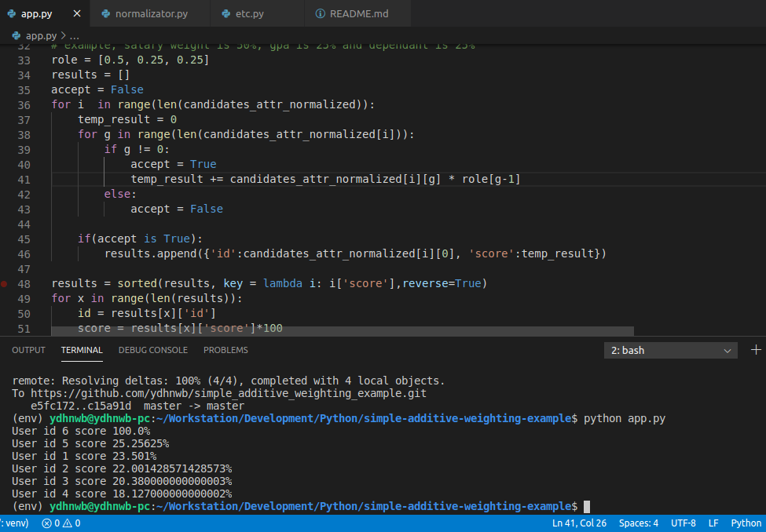

# simple_additive_weighting_example
A simple approach to get a scholarship using three attributes of candidates: parent_salary (50%), gpa(25%), number_of_dependant(25%)

# dummy data
you can see the dummy data in etc.py
or you can see this data below

<pre><code>
[
    {
        'id':1,
        'name':'Prieyudha Akadita S',
        'attributes':{
            'salary': 5000000,
            'dependant' : 3,
            'gpa' : 3.7
        }
    },{
        'id':2,
        'name':'Izzatur Royhan',
        'attributes':{
            'salary': 3500000,
            'dependant' : 1,
            'gpa' : 3.5
        }
    },{
        'id':3,
        'name':'Hellboy',
        'attributes':{
            'salary': 1000000,
            'dependant' : 8,
            'gpa' : 3.1
        }
    }, {
        'id':4,
        'name':'Abu Muslih Assulkhani',
        'attributes':{
            'salary': 2500000,
            'dependant' : 10,
            'gpa' : 2.7
        }
    }, {
        'id':5,
        'name':'Den Baguse',
        'attributes':{
            'salary': 800000,
            'dependant' : 2,
            'gpa' : 4.0
        }
    }
]
</code></pre>

# How to run this?
Make sure you have a virtualenvironment created. 
then run using syntax:
<pre><code>python app.py
</code></pre>

# Screenshot

